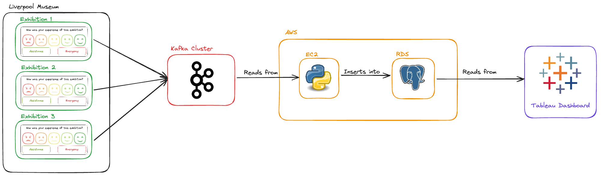

# LMNH Data Pipeline

This folder should contain all code, documentation and resources required for the LMNH data pipeline.

## Project Context

The Liverpool Museum of Natural History (LMNH) hosts hundreds of thousands of visitors every year, coming to view award-winning exhibitions such as "Fossils of the Ancient Nile" and "Inordinately Fond: Biodiversity in Beetles".

LMNH's core mission is 'to provide value to the Liverpool community and the wider public'. As part of this mission, the museum regularly collects data on visitor satisfaction and wellbeing, which is then used to target exhibition development and maintenance. In the past, the museum has collected this data through written surveys and online reviews, but LMNH has recently secured funding for a new project focused on gathering immediate user feedback. This project is currently being trialled in several key exhibitions.

"Smiley Face Survey Kiosks" have been placed at the exits of the exhibitions; visitors are asked to rate their experience of the exhibition on a five-point scale (from 😡 to 😀). Each kiosk features two other buttons: an "assistance" button, for general enquiries, and an "emergency" button for immediate support.

While the kiosks are currently operational, nothing is actually being done with the visitor data yet. LMNH wants to develop an automated pipeline that would combine, store, and analyse all the kiosk data automatically, allowing museum staff to access continually-updating information on the museum's operation.

## The Solution 

Please find an architecture diagram of the pipeline below:

## File Explanation 
### .venv
It's a good idea to first create and activate a virtual environment, you can do this by running the following commands:
- python3 -m venv .venv
- source .venv/bin/activate

### requirements.txt
Before running the script, in order to ensure all necessary packages are installed run the following command in the terminal:
- pip3 install -r requirements.txt

### .env
You will have to create a .env file containing the following details (fill the blanks '=      '):
- For your target RDS:
DATABASE_USERNAME=
DATABASE_PASSWORD=
DATABASE_PORT=5432
DATABASE_NAME="
DATABASE_IP=

- For your target kafka stream:
BOOTSTRAP_SERVERS=
SECURITY_PROTOCOL=
SASL_MECHANISM=
USERNAME=
PASSWORD=
GROUP=

- AWS access
aws_access_key_id=
aws_secret_access_key=

### lmnh_etl.py file
This etl script consumes messages from kafka, validates them and transforms them before loading them into a AWS RDS. This script also comes equipped with a command line interface:

CLI:
- "-t", "--topic", default="lmnh", help="Choose the consumers topic 'lmnh' is the default" - optional argument
- "-f", "--filename", default="errors.txt", help="Choose an output filename - default is errors.txt" - optional argument
- "-l", "--log_destination", default="terminal", help="Choose to log errors to a 'file' or 'terminal'" - optional argument

It is not necessary to enter any cli arguments to run the script unless you want to modify one of the cli inputs as explained in CLI.

### db_clear.bash
To clear the database before running the lmnh_etl.py script run the db_clear.bash file using 'bash db_clear.bash' this will reset the database but keep the static information e.g exhibitions, floors, rating values etc.

### db_connect.bash
To connect to your database run 'bash db_connect.bash'.

### ec2-connect.bash
To connect to you ec2 instance run 'bash ec2_connect.bash'.

